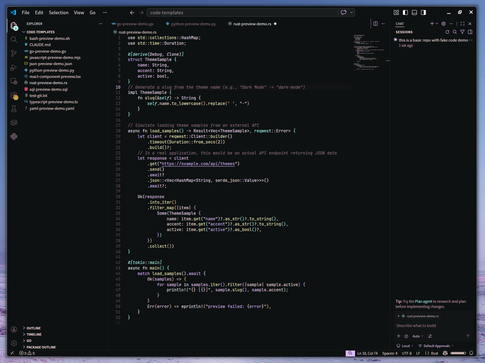

# SAGA Dark

SAGA Dark is a pastel dark theme for Visual Studio Code with an almost-black UI and soft syntax colors.

It keeps the SAGA palette soft and dreamy, but extends the theme well beyond a screenshot-first palette port. The editor, quick pick, breadcrumbs, notifications, notebooks, testing and debug UI, gutters, minimap, and settings are all themed to feel consistent with the same pink, peach, mint, and cyan palette language.

Designed for developers who want:
- a soft dark theme without washed-out syntax
- stronger consistency across VS Code UI surfaces, not just the editor
- broader language and semantic token coverage so real projects do not fall back to default styling



## Why SAGA Dark

Many pastel themes look good in a single file and start breaking apart once semantic highlighting, notebooks, Git changes, quick pick, and language-specific scopes enter the picture.

SAGA Dark is tuned to stay coherent in actual work:
- broad TextMate coverage for common languages and markup formats
- semantic token support for symbol-aware highlighting
- expanded UI color coverage across core VS Code surfaces
- Saga-specific status and selection mappings so errors, warnings, diffs, and active states still read clearly

## Included

- Dark SAGA UI theme for VS Code
- Semantic highlighting enabled by default
- Expanded syntax highlighting coverage for Python, Rust, JSON, TOML, Markdown, Shell, CSS, HTML, YAML, and diff views
- Themed quick pick, breadcrumbs, notifications, notebooks, testing/debug UI, gutters, minimap, and settings surfaces

## Coverage

- `474` UI color keys themed
- `119` token color rules themed
- `52` semantic token selectors themed
- Semantic highlighting enabled by the theme

## Palette

- `#05080a` Liquorice
- `#0A0D0F` Vampire Black
- `#0f1214` Charcoal
- `#141719` Asphalt
- `#ffe1e1` Misty Rose
- `#ffc2df` Cotton Candy
- `#ffaecb` Lavender Pink
- `#ff9fbc` Pastel Magenta
- `#ffc79b` Pastel Peach
- `#fff6c3` Blond
- `#baf7b5` Menthol
- `#b2fff3` Celeste
- `#dfbaff` Mauve
- `#f3ceff` Pale Lavender
- `#ffe2ff` Pink Lace
- `#ffecff` Magnolia
- `#fff6ff` Snow

## Install

Install from the VS Code Marketplace or from the command line:

```bash
code --install-extension oldjobobo.saga-dark
```

Or search for `SAGA Dark` in VS Code.

## Use

Open the Command Palette, run `Preferences: Color Theme`, and select `SAGA Dark`.

## Development

The checked-in theme file at `themes/saga-palette-color-theme.json` is generated output.

Source files live under `src/theme/`:
- `palette.json`
- `metadata.json`
- `colors.json`
- `semantic-token-colors.json`
- `token-colors.json`

Rebuild the generated theme with:

```bash
npm run build
```

## Notes

- The palette stays faithful to the original SAGA color system, but the token and UI mapping is tuned for daily use in real projects.
- Status colors were adjusted so errors, warnings, selections, and Git changes remain readable instead of blending into the pastel UI.

## License

Released under the [MIT License](LICENSE).
